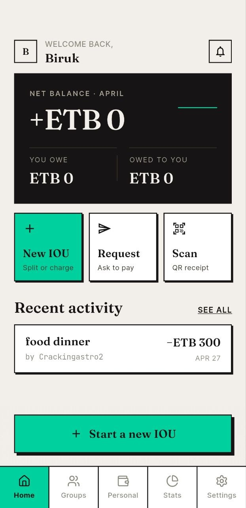
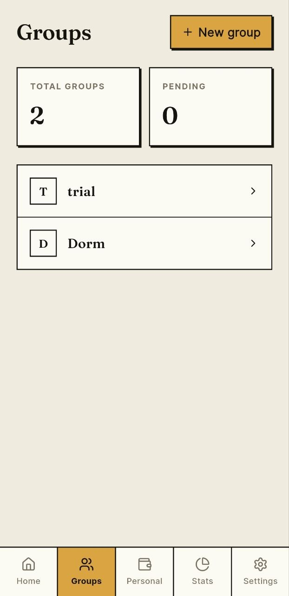
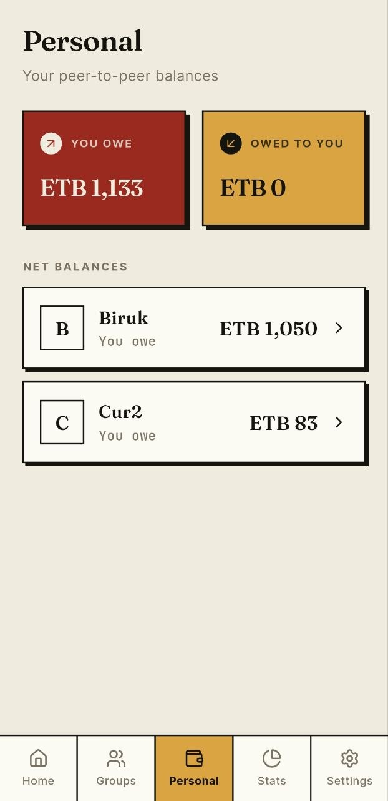
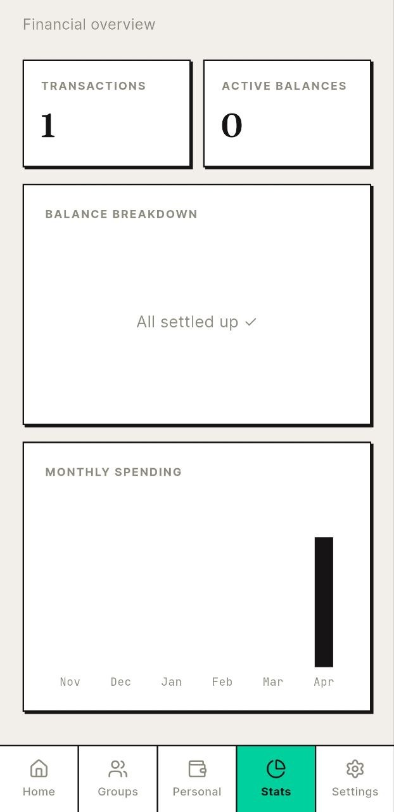
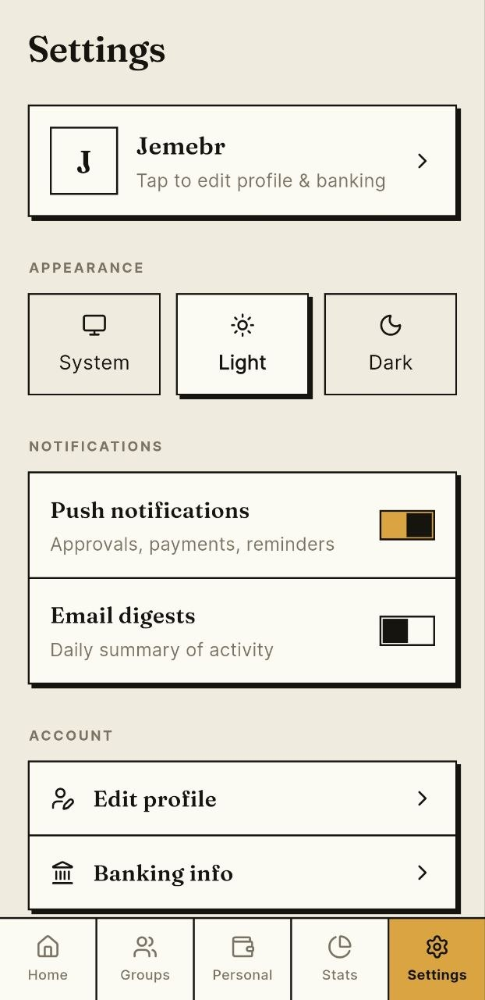

# EDA — Split expenses, track debts, get paid back.

EDA is a mobile app that makes it easy to track who owes whom in your friend group, dorm, or household. Create shared expenses, request payments, and keep everyone's balances up to date — all in Ethiopian Birr.

  
  
  

> **Install:** Download the APK from the badge above → open it on your Android device → allow "Install unknown apps" if prompted.

---

## Screenshots

  
  
  
  
  

---

## What you can do

### Home
See your overall balance at a glance — how much you owe and how much others owe you this month. From here you can start a new expense, request payment from someone who owes you, or scan a QR receipt.

### Groups
Create shared expense groups for your dorm, housemates, or any recurring situation. Invite friends by searching their name — they receive an invitation and can accept or decline. Once in a group, any member can log an expense and split it equally or however makes sense.

### Personal
See a list of every person you have an open balance with. Tap any name to see the full history between you two, request payment, or confirm a payment they've marked as sent.

### Stats
A quick financial overview: total transactions, active balances, a donut chart of what you owe vs. what's owed to you, and a monthly spending bar chart so you can see how things trend over time.

### Settings
Switch between light and dark mode, toggle push notifications on or off, and manage your profile and banking info so others know how to pay you back.

---

## How a typical flow works

1. **You pay for dinner** → tap "New IOU", add the people at the table, enter the total, split equally. Everyone gets notified.
2. **Your friend marks it paid** → they open Personal, find your name, enter the amount they sent, and submit.
3. **You confirm** → you get a notification, open the request, tap Confirm. The balance updates instantly.
4. **Balance hits zero** → the person disappears from your list automatically.

---

## Signing in

EDA uses Google sign-in or email/password. On first launch you'll set a display name and add your bank account details (CBE, Telebirr, Zemen, etc.) so people can pay you back through the right channel.

---

## Privacy

All data lives in your Supabase project. Only users you share groups or transactions with can see your balance information. Notification content stays on-device unless you enable push.
